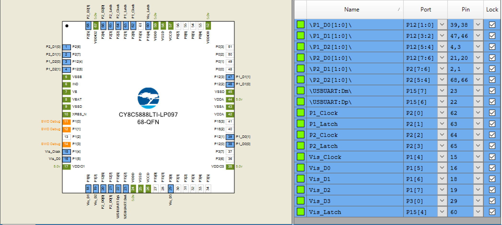
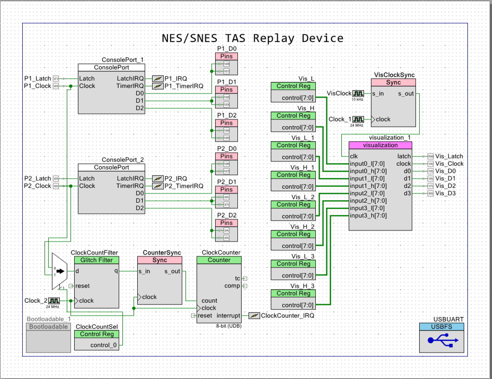
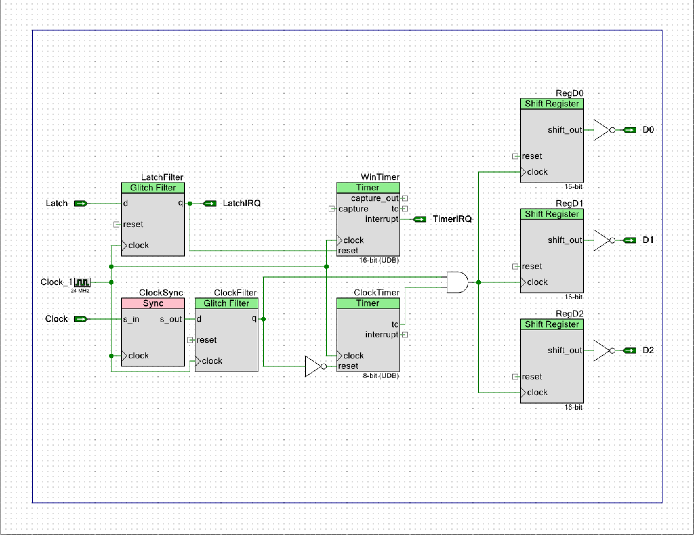

# Cypress PSoC 5 based console replay device

## Overview

This repo contains firmware, scripts, documentation, and PCBs for creating a Tool Assisted Speedrun replay device for the Nintendo Entertainment System (NES) and Super Nintendo Entertainment System (SNES). It is based on the [Cypress PSoC 5LP](http://www.cypress.com/products/32-bit-arm-cortex-m3-psoc-5lp). A development kit: [CY8CKIT-059](http://www.cypress.com/documentation/development-kitsboards/cy8ckit-059-psoc-5lp-prototyping-kit-onboard-programmer-and) is commonly used to build this replay device as it is available from multiple electronics distributors and available for less than $15 USD.

## Compiling/Flashing the firmware to the development kit
This requires a Windows environment to perfrom the steps due to the Cypress PSoC Creator IDE application.

 1. Download and install the [Cypress PSoC Creator IDE](http://www.cypress.com/products/psoc-creator-integrated-design-environment-ide)
 2. Clone this repository to your machine (or alternatively download the tar/zip ball)
 3. Open the TASBot.cywrk file with Cypress PSoC Creator
 4. Click on Build => Clean and Build TASBot
    In the Output window you should see many messages scroll by ending with `Rebuild Succeeded`
 5. Click on Debug => Program
    In the Output window you should see many messages scroll by ending with `Device 'PSoC 5LP CY8C5888LT*-LP097' was successfully programmed`
 6. Close Cypress PSoC Creator
 7. The device is now ready for use

## Cables
The PSoC5 needs to be physically attached to the NES/SNES via some kind of cable. This can be via a breadboard and jumper wires or elaborate setups with visualization boards, RJ45 connectors, and custom cabiling.

Depending on the movie you want to replay depends on if a "normal" extension cable can be used to connect the PSoC5 and the console. If the movie only uses one controller or Y cable configuration (no multitaps) an extension cable may be able to be used and directly connected to the PSoC5. Best case is to always check your extension cables for compatibility or build your own.

There isn't much need for multi-tap support for replay devices as most TAS ACEs are done with Y cable or normal controller configurations.

### Controller Pinouts

The PSoC 5 has fully re-configurable pins. The below layout describes the default configuration.

Some lines have two PCB Pins specified. This means that there should be a connection from both pins to the given SNES/NES controller pin.

#### Player 1

| PSoC Name  | Description    | PCB Pin | SNES Pin   | NES Pin   |
| ---------- | -------------- | ------- | ---------- | --------- |
| P1_D0[1:0] | Player 1 D0    | 120,121 | 4          | 4         |
| P1_D1[1:0] | Player 1 D1    | 122,123 | 3          | 6         |
| P1_D2[1:0] | Player 1 D2    | 124,125 | 2          | 7         |
| P1_Latch   | Player 1 Latch | 21      | 5          | 3         |
| P1_Clock   | Player 1 Clock | 20      | 6          | 2         |

#### Player 2

| PSoC Name  | Description    | PCB Pin | SNES Pin   | NES Pin   |
| ---------- | -------------- | ------- | ---------- | --------- |
| P2_D0     | Player 2 D0     | 126,127 | 4          | 4         |
| P2_D1     | Player 2 D1     | 26,27   | 3          | 6         |
| P2_D2     | Player 2 D2     | 24,25   | 2          | 7         |
| P2_Latch  | Player 2 Latch  | 23      | 5          | 3         |
| P2_Clock  | Player 2 Clock  | 22      | 6          | 2         |

### Visualization Board Pinouts

| PSoC Name  | Description         | PCB Pin |
| ---------- | ------------------- | ------- |
| Vis_D0     | Visualization D0    | 15      |
| Vis_D1     | Visualization D1    | 16      |
| Vis_D2     | Visualization D2    | 17      |
| Vis_D3     | Visualization D3    | 30      |
| Vis_Latch  | Visualization Latch | 154     |
| Vis_Clock  | Visualization Clock | 14      |

### PSoC5 pinouts and schematics

The pinout of the PSoC5:

The overall schematic design of the replay device:

The detailed schematic of the controller ports:

## Using the replay device
The replay device is supported on any platform that supports Python3 and supports USB Serial devices.

 1. Install [python3](https://www.python.org/download/releases/3.0/) for the platform you want to run your replay device on
 2. Install [pip](https://pip.pypa.io/en/stable/installing/)
 3. Clone this repository to your machine (or alternatively download the tar/zip ball)
 4. Install the python prerequisites:
    * Type: `pip3 install pyserial` (you may need sudo or just pip depending on how python is installed on your system)
    * NOTE: Do not install the `serial` python library. If you have it installed remove it by typing `pip3 uninstall serial`. It will cause conflicts. If you see the error: `AttributeError: module 'serial' has no attribute 'Serial'` the serial library is installed and must be uninstalled.
 5. Use the correct Python script to run the movie file
    * The Python scripts are located in the Scripts directory
    * You have to use the correct script for the movie you want to play back:
      * NES - play_r08.py
      * SNES YCable/Single - play_r16y.py
      * SNES Multitap - play_r16m.py
    * Type: `python3 {nameOfScript} {serialDevice} {pathToMovieFile}` OR `./{nameOfScript} {serialDevice} {pathToMovieFile}`
      * Where `{nameOfScript}` is the name of one of the scripts listed above
      * Where `{serialDevice}` is the name/path of the serial device created by the replay device. example: `/dev/ttyACM0`, `COM3`, `/dev/tty.usbmodem1411`, etc.
      * Where `{pathToMovieFile}` is the path to an .r08 or.r16m.
 6. Best practice is to start with the console off, run the python script, then turn the console on.
